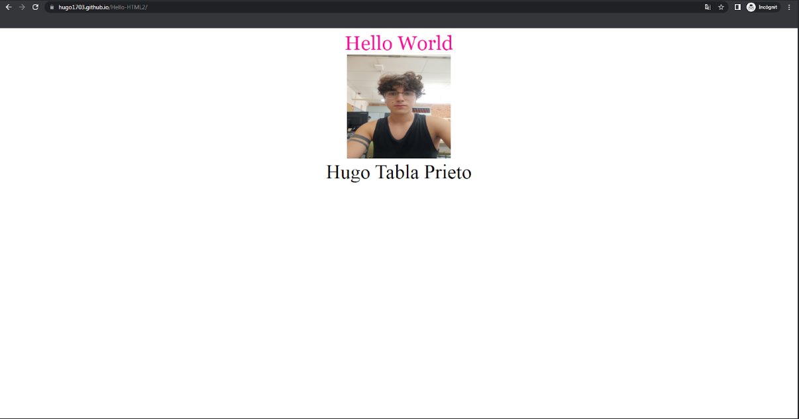

# Hello-HTML2
Este projecto se basaen crear con el software Github un proyecto, en el cual tendremos que hacer que en nuestra pagina web aparezca un titulo, una foto nuestra y nuestro nombre. 
Tambien tendremos que enviarle una Issue a nuestro compañero y este a nosotros para que tengamos que modificar el codigo del proyecto.

Para poder descargar el codigo tenemos que copiar el enlace desde donde pone code y seguidamente entrar en la terminal y usar el comando git clone para hacer una clonación del codigo.
Si queremos modificarlo podriamos usar algun programa que se encarga de eso como por ejemplo Visual Studio Code aunque tambien lo podriamos cambiar directamente desde github.

